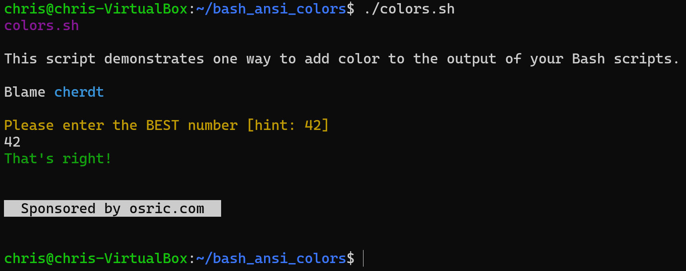

Example Bash script with output colors
======================================

I've written a zillion Bash scripts but I've never modified the color of the output before! What fun. And possibly useful.

Adding this here so I remember how to do it again later.

Color codes via https://talyian.github.io/ansicolors/

Usage:
------

    ./colors.sh

You might need to add the execute bit:

    chmod +x colors.sh

Sample output:

